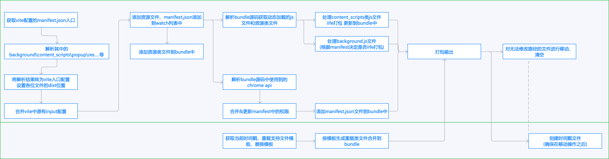

# vite-plugin-vue-crx3

本 Vite 插件用于使用 vite2+vue3 开发 chrome 拓展（manifest v3），且支持开发过程中插件热重载

## 推荐环境

-   node: v14+
-   npm: v7+
-   manifest version: 3
-   vite2+vue3

## 使用方法

### 1、安装插件

```bash
npm i -D vite-plugin-vue-crx
```

### 2、一般开发项目结构

一个 chrome 拓展一般包含多个入口 js（background.js、若干 content_scripts 类 js），以及多个入口 HTML（popup.html、newtab.html 等），所以需要采用 vite2+vue3 开发多页应用的模式，开发后打包生成多个入口文件。

但是往往一个 Chrome 拓展的入口 js 和 html 个数和名称都是不固定的，如果直接配置到 vite.config.js 后，还需要兼容修改 manifest.json，很麻烦。

所以，本插件的核心就是：就以 manifest.json 作为入口文件，自动分析 manifest 中的开发配置，获取 vue 应用的各个入口文件，打包时自动将 manifest.json 中开发路径更新为生产路径。

一般建议的开发目录结构如下，不强制要求：

|-public // chrome 语言包放 public 里
|-src
|--|-manifest.json // 开发的入口文件，从中可解析真实的入口文件
|--|-assets
|--|-store
|--|-libs // 我一般习惯把 Chrome 拓展相关的开发文件都放在一个文件夹下面
|--|--|-popup.html
|--|--|-newtab.html
|--|--|-newtab
|--|--|--|-main.js
|--|--|--|-App.vue
|--|-store // 把 store 拿出来，可以作为多页共享的数据
|--|-components // 一些常用的 vue 组件
|-vite.config.js
|-package.json
|-dist // 打包后的 Chrome 拓展源文件

### 3、配置 vite.config.js

vite 配置的核心就是引用插件、设置入口文件。

```js
import { defineConfig } from "vite"
import { resolve } from "path"
import vue from "@vitejs/plugin-vue"
import { crx3 } from "./es/index.js"
export default defineConfig({
    plugins: [vue(), crx3()], // crx3即为插件入口函数
    resolve: {
        alias: {
            "@": resolve(__dirname, "src"),
        },
    },
    build: {
        target: "es2015",
        rollupOptions: {
            input: resolve(__dirname, "src/manifest.json"), // 将源码中的manifest.json作为入口文件
        },
    },
})
```

### 4、manifest.json 设置注意事项

放在 src 下的 manifest.json 只服务于开发环境，因此 manifest.js 设置各个入口文件时，路径按照常规思维设置其相对路径即可，插件打包时会自动更新打包后的路径。

比如，我们基于 src/libs/background/main.js 来开发 backround.js 文件，那么其设置：

```json
{
    "manifest_version": 3,
    "name": "__MSG_appTitle__",
    "version": "1.0.0",
    "description": "__MSG_appDescription__",
    "host_permissions": ["<all_urls>"],
    "background": {
        "service_worker": "./libs/background/main.js" // 直接设置manifest.json的相对路径即可，不需要考虑真实插件的路径
    }
}
```

### 5、插件热重载

推荐：在 package.json 中配置专门用于插件热重载的指令：

```json
"scripts": {
    "watch": "vite build --watch",
    "serve": "vite preview",
    "build": "vite build",
    "dev": "vite"
}
```

这样，开发时使用：npm run watch，即可启用热重载功能，其体现在 2 个方面（修改保存时）：

-   Chrome 浏览器自动更新当前开发的插件；
-   正在调用的网页会自动刷新。
    省时省力~

当然，如果要打包发布，请最后还是使用：npm run build。热重载时，dist 中会生成多个和你项目无关的、支撑热重载功能的临时文件。

## 插件原理

下图展示了整个插件的思路，核心包含 2 部分：

-   根据入口 manifest，解析项目中全部的入口文件，其中 background.js 和全部类型的 content_scripts 均会以 iife 模式打包；
-   独立的热重载插件，会生成临时文件支撑插件和网页的重载。
    

## 版本功能

### v1.0

-   支持解析 manifest.json 配置的各类 js 和 html 入口文件。
-   自动解析通过 chrome.scripting.insertCSS、chrome.scripting.executeScript 动态导入的资源文件和 js 文件。
-   自动解析代码中调用的 Chrome API 并更新 manifest 中的权限（除 tabs、activeTab、webRequestBlocking、background 四个权限未处理）
-   将 background、content_scripts 类 js 默认打包为 iife 模式（由于 Chrome 91+ 支持 background 使用 es 模具，固如果 manifest.json 中 background.type=module，则 background 不会进行 iife 打包）
-   不论开发目录如何设置，打包后插件的各类入口文件均在目录顶层，并自动更新生成的 manifest.json 中各文件路径。
-   通过时间戳文件和轮询，实现 Chrome 拓展的自动重载。
-   通过 getManifest 和轮询，实现拓展重载后，各网页的自动刷新。

### todo...

-   对 manifest.json 进行格式、字段的校验并提醒。
-   （常用开发场景）支持 vite2+vue3 快速开发嵌入页面，即自动通过 content_scripts 将页面组件嵌入网页。

## 参考

当有了编写该插件想法时，查找了一些相关资料，并发现了一个同类型的 rollup 插件[vite-plugin-chrome-extension]（https://github.com/StarkShang/vite-plugin-chrome-extension），在本插件开发过程中有较多的借鉴。
